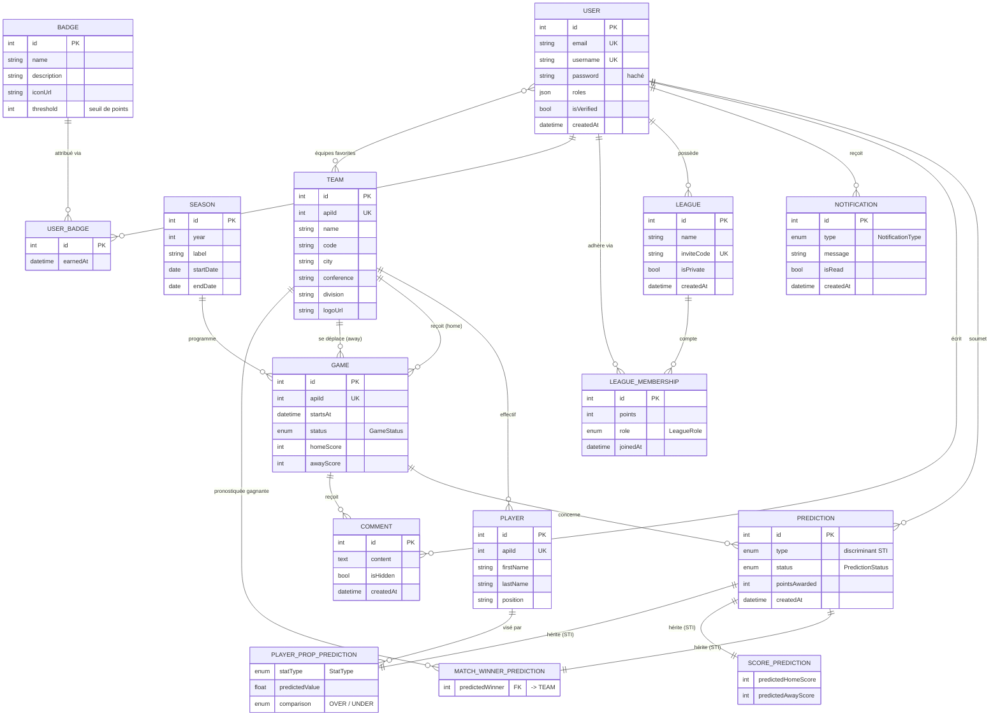

# Cahier des charges — Buzzer 🏀

> Plateforme web de pronostics NBA (sans enjeu monétaire) — projet de fin de cycle Symfony.
> Voir aussi le [guide d'installation](README.md).

---

## 1. Présentation du projet

### 1.1 Contexte et objectifs

**Buzzer** est une application web communautaire autour de la NBA : les
utilisateurs pronostiquent l'issue des matchs, gagnent des points selon un
barème qui récompense la difficulté, s'affrontent dans des **ligues privées**
entre amis et progressent via un système de **badges** et de **notifications**.

Aucune mise d'argent : la compétition est purement ludique (classements).

### 1.2 Périmètre fonctionnel

| Module | Contenu |
|---|---|
| Référentiel NBA | Saisons, équipes, joueurs et matchs, synchronisés depuis l'API externe [api-sports.io](https://api-sports.io) |
| Comptes | Inscription avec confirmation e-mail, connexion, profil, équipes favorites |
| Pronostics | 3 types de pronostics (vainqueur, score exact, performance joueur), règlement automatique, historique |
| Ligues | Création, invitation par code ou e-mail, classement par points |
| Social | Commentaires sur les matchs, modération |
| Gamification | Badges à seuils de points, notifications in-app |
| Back-office | Tableau de bord statistiques, gestion des utilisateurs, modération |
| API publique | Endpoints JSON en lecture seule (`/api/v1/...`) |

---

## 2. Rôles utilisateurs

| Rôle | Description | Capacités principales |
|---|---|---|
| **Visiteur** (non connecté) | Découverte | Consulter l'accueil, le calendrier des matchs, l'API publique ; s'inscrire ; se connecter |
| **`ROLE_USER`** | Membre inscrit (e-mail vérifié) | Pronostiquer, gérer ses pronostics avant tip-off, créer/rejoindre des ligues, commenter, gérer son profil et ses équipes favorites |
| **`ROLE_MANAGER`** | Modérateur | Tout `ROLE_USER` + espace de modération (masquer/rétablir des commentaires) |
| **`ROLE_ADMIN`** | Administrateur | Tout `ROLE_MANAGER` + back-office (statistiques, gestion des rôles et des comptes), usurpation d'identité (`switch_user`) pour le support |

---

## 3. Sécurité et droits d'accès

### 3.1 Authentification

- Formulaire de connexion natif (`LoginFormAuthenticator`, Security Component),
  protection **CSRF** et fonction *remember me* (7 jours) ;
- Mots de passe hachés via le **Password Hasher** (algorithme `auto`) ;
- Inscription avec **vérification de l'adresse e-mail** (lien signé,
  VerifyEmailBundle) — l'e-mail de confirmation est envoyé via le **Mailer** ;
- Identifiant de connexion : l'adresse e-mail (provider Doctrine).

### 3.2 Hiérarchie des rôles

Les trois rôles applicatifs sont **hiérarchiques** — chaque rôle supérieur
hérite des permissions du rôle inférieur :

```
ROLE_ADMIN  ─▶  ROLE_MANAGER  ─▶  ROLE_USER
```

`ROLE_ADMIN` reçoit également `ROLE_ALLOWED_TO_SWITCH` (usurpation d'identité).

### 3.3 Cloisonnement des fonctionnalités (`access_control`)

| Chemin | Rôle requis |
|---|---|
| `/login`, `/`, `/matchs`, `/api/v1/...` | Public |
| `/profile`, `/predictions`, `/leagues` | `ROLE_USER` |
| `/moderation` | `ROLE_MANAGER` |
| `/admin` | `ROLE_ADMIN` |

### 3.4 Permissions fines : les Voters

Trois **Voters personnalisés** portent les règles liées au cycle de vie des
objets, que `access_control` ne peut pas exprimer :

| Voter | Règle portée |
|---|---|
| `PredictionVoter` | RG-01 : un pronostic ne peut être modifié/supprimé **que par son auteur** et **tant que le match n'a pas commencé** |
| `LeagueVoter` | RG-08 : une ligue ne peut être gérée (renommage, exclusion d'un membre, suppression) que par **son propriétaire** — ou un administrateur |
| `CommentVoter` | RG-09 : édition/suppression réservées à **l'auteur** ; masquage (modération) réservé à `ROLE_MANAGER` / `ROLE_ADMIN` |

---

## 4. Cas d'utilisation (Use Cases)

### 4.1 Comptes (UC-0x)

| UC | Acteur | Description |
|---|---|---|
| UC-01 | Visiteur | S'inscrire (pseudo, e-mail, mot de passe) |
| UC-02 | Visiteur | Confirmer son adresse e-mail via le lien signé reçu |
| UC-03 | Visiteur | Se connecter / se déconnecter |
| UC-04 | User | Consulter et modifier son profil |
| UC-05 | User | Gérer ses équipes favorites (ManyToMany `User` ↔ `Team`) |

### 4.2 Matchs et pronostics (UC-1x)

| UC | Acteur | Description |
|---|---|---|
| UC-10 | Visiteur | Consulter le calendrier paginé des matchs |
| UC-11 | Visiteur | Consulter le détail d'un match (équipes, score, commentaires) |
| UC-12 | User | Saisir un pronostic via le **formulaire dynamique** : le choix du type (vainqueur / score exact / performance joueur) reconstruit les champs (Form Events) |
| UC-13 | User | Modifier ou annuler son pronostic **avant le tip-off** (RG-01, `PredictionVoter`) |
| UC-14 | User | Consulter son historique de pronostics et ses points |

### 4.3 Social et gamification (UC-2x)

| UC | Acteur | Description |
|---|---|---|
| UC-20 | User | Commenter un match |
| UC-21 | User | Modifier / supprimer son propre commentaire (RG-09) |
| UC-22 | User | Consulter ses notifications (résultats, badges, invitations) |

### 4.4 Ligues (UC-3x)

| UC | Acteur | Description |
|---|---|---|
| UC-30 | User | Créer une ligue (l'auteur en devient propriétaire) |
| UC-31 | User | Rejoindre une ligue via son **code d'invitation** (RG-06, RG-07) |
| UC-32 | User | Inviter un ami **par e-mail** (Mailer) |
| UC-33 | User | Consulter le classement de la ligue (points cumulés, RG-05) |
| UC-34 | User | Gérer sa ligue : renommer, exclure un membre, supprimer (RG-08, `LeagueVoter`) |

### 4.5 Back-office (UC-4x)

| UC | Acteur | Description |
|---|---|---|
| UC-40 | Manager | Modérer les commentaires signalés (masquer / rétablir) |
| UC-41 | Admin | Lancer la synchronisation NBA depuis la console (`app:nba:sync`) |
| UC-42 | Admin | Consulter le tableau de bord (statistiques globales) |
| UC-43 | Admin | Gérer les utilisateurs (rôles, comptes) |
| UC-44 | Admin | Déclencher le règlement des pronostics (`app:predictions:settle`, mode `--async` via Messenger) |

### 4.6 Processus système (UC-5x)

| UC | Déclencheur | Description |
|---|---|---|
| UC-50 | CLI / planification | Synchroniser les **équipes** depuis l'API NBA (upsert idempotent par `apiId`, RG-12) |
| UC-51 | CLI / planification | Synchroniser les **matchs et joueurs** ; à la fin d'un match, déclencher UC-52 |
| UC-52 | Fin de match | **Régler les pronostics** du match : statut gagné/perdu, points (RG-03, RG-04), classements de ligue (RG-05) — exécutable en asynchrone (message `SettleGameMessage`) |
| UC-53 | Attribution d'un badge | Émettre une **notification** au gagnant |
| UC-54 | Après règlement | **Attribuer les badges** dont le seuil de points est atteint (RG-10) |

---

## 5. Règles de gestion

| Règle | Énoncé | Implémentation |
|---|---|---|
| **RG-01** | Un pronostic n'est accepté / modifiable que si le match est programmé et que le tip-off n'a pas eu lieu | `Game::isOpenForPredictions()` + `PredictionVoter` |
| **RG-02** | Un utilisateur ne peut soumettre qu'**un pronostic par match et par type** | Contrainte unique `user_id + game_id + type` |
| **RG-03** | Le règlement n'opère que sur un match **terminé avec score officiel** et est **idempotent** (jamais de double crédit) | `PredictionSettlementService` |
| **RG-04** | Le barème récompense la difficulté : vainqueur = 10 pts ; score exact = 30 pts ; bon vainqueur mais mauvais score = 5 pts ; performance joueur = 15 pts | `ScoringPolicy` |
| **RG-05** | Les points gagnés sont répercutés sur le classement de **chacune des ligues** de l'auteur | `PredictionSettlementService` |
| **RG-06** | Chaque ligue expose un **code d'invitation unique** | Contrainte unique sur `invite_code` |
| **RG-07** | Un utilisateur ne peut pas rejoindre deux fois la même ligue | Contrainte unique `user_id + league_id` |
| **RG-08** | Une ligue n'est gérée que par son propriétaire (ou un admin) | `LeagueVoter` |
| **RG-09** | Un commentaire n'est modifiable que par son auteur ; seul un manager/admin peut le masquer | `CommentVoter` |
| **RG-10** | Un badge ne peut être gagné qu'**une seule fois** par utilisateur | `BadgeAwardService` + contrainte unique `user_id + badge_id` |
| **RG-11** | Tout événement significatif (badge débloqué, résultat de pronostic, invitation) génère une notification in-app | `Notification` + services émetteurs |
| **RG-12** | La synchronisation NBA est **idempotente** : les entités sont rapprochées par leur identifiant API (`apiId`), jamais dupliquées | `NbaSynchronizer` |

---

## 6. Modèle de données

**15 entités Doctrine** — dont une hiérarchie d'héritage **Single Table
Inheritance** : `Prediction` (abstraite) est déclinée en
`MatchWinnerPrediction`, `ScorePrediction` et `PlayerPropPrediction`
(colonne discriminante `type`).

Relations :

- **ManyToMany** : `User` ↔ `Team` (équipes favorites) ; deux associations
  **avec attributs de liaison** modélisées en entités : `LeagueMembership`
  (`User` ↔ `League`, portant points / rôle / date) et `UserBadge`
  (`User` ↔ `Badge`, portant la date d'obtention) ;
- **16 relations ManyToOne / OneToMany** (voir diagramme) ;
- Énumérations PHP natives : `GameStatus`, `PredictionStatus`, `StatType`,
  `Comparison`, `LeagueRole`, `NotificationType`.

### 6.1 Diagramme entité-association (MCD)



> Les trois sous-types de `PREDICTION` partagent la **même table**
> (`prediction`) : l'héritage est matérialisé par la colonne discriminante
> `type` (`match_winner` / `score` / `player_prop`).

---

## 7. Architecture technique

| Exigence | Choix retenu |
|---|---|
| Framework | Symfony 7.4, PHP 8.3, PostgreSQL 16, Docker |
| API publique | Contrôleur dédié `/api/v1/games` — Serializer + groupes de normalisation (`game:list`, `game:detail`, `team:read`, `season:read`), contexte affiné (dates ATOM) |
| E-mails | Mailer : confirmation d'inscription (VerifyEmailBundle) et invitation de ligue |
| API externe | HttpClient **scopé** vers api-sports.io (clé en variable d'environnement) |
| Asynchronisme | Messenger, transport **Doctrine** : règlement des matchs en file (`SettleGameMessage`), retry exponentiel + file `failed` |
| Formulaires | `PredictionType` **dynamique** (Form Events `PRE_SET_DATA` / `PRE_SUBMIT`) |
| Performance | Repositories QueryBuilder avec **fetch joins** (anti-N+1), pagination Doctrine |
| Front | Twig (héritage de blocs, thème de formulaire Tailwind, filtre personnalisé `status_class`), TailwindCSS sans Node |
| Qualité | PHPUnit (unitaires, intégration, fonctionnels WebTestCase), PHPStan niveau 6, linters Symfony, CI GitHub Actions |

---

## 8. Comptes de démonstration

Voir le [README](README.md#comptes-de-test-mot-de-passe-commun--password) —
mot de passe commun `password` : `admin@buzzer.test` (`ROLE_ADMIN`),
`manager@buzzer.test` (`ROLE_MANAGER`), `user@buzzer.test` (`ROLE_USER`).
